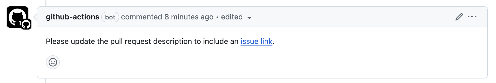

# Require Linked Issue

This project provides a [GitHub Actions][actions] [workflow][workflow] that
will require each pull request to include an [issue link][issuelink]. It looks
for the following phrases:

+ `close #1`
+ `closes #1`
+ `closed #1`
+ `fix #1`
+ `fixes #1`
+ `fixed #1`
+ `resolve #1`
+ `resolves #1`
+ `resolved #1`

Where `#1` can also be `owner/repo#1`.

If any of these phrases are found in the pull request description, i.e.
the text body presented as the original poster's comment in the UI, then the
action will pass. If such a phrase is not found, the action will fail.

Upon failure, a comment will be added asking the author to provide a link:

The action always updates its original comment. So, when the action eventually
passes, the comment will be updated to thank the user for providing the link:

This workflow was inspired by https://x.com/mitchellh/status/1852039089547309552:

## Install

Copy the [require-link.yaml](./github/workflows/require-link.yaml) workflow
to your project's GHA workflows directory.

[actions]: https://docs.github.com/en/actions
[workflow]: https://docs.github.com/en/actions/writing-workflows/about-workflows
[issuelink]: https://docs.github.com/en/issues/tracking-your-work-with-issues/using-issues/linking-a-pull-request-to-an-issue
